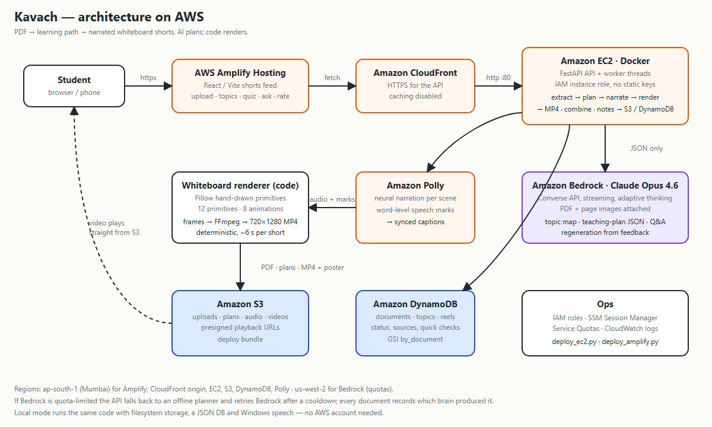

# Kavach — First Commit submission (Ship It track)

Copy-paste material for the WeMakeDevs submission form, plus the demo-video script.

## One-liner
Kavach turns any study PDF into a learning path of 30–60 second narrated whiteboard revision
shorts — grounded in the PDF's own pages, with quick checks — so students revise faster
without losing the substance. *Compress the delivery, not the knowledge.*

## Links
- Live app: https://main.d1ex6vljuszbzw.amplifyapp.com
- API health: https://di1ubb11ugmj1.cloudfront.net/health
- Code: https://github.com/Sanilg1/kavach
- Demo PDF to try: `backend/assets/demo_computer_networks.pdf` (10 pages, Computer Networks)

## Problem
Exam revision means re-reading dense 60-page PDFs. Summaries throw away the substance;
videos on YouTube don't match the syllabus. Students on the other side of this get a
learning order, a short visual explanation per concept, the exact source pages, and a
question to check themselves — from *their* material, in minutes.

## What it does
1. Upload notes as PDF, DOCX, PPTX, TXT or Markdown (≤ 60 pages); non-PDFs are converted to PDF. Kavach extracts text and page images and checks suitability.
2. The Brain AI (Claude on Amazon Bedrock) builds a **topic map**: concepts, prerequisites,
   difficulty, recommended learning order, estimated shorts.
3. The student adds/removes/reorders topics.
4. For each topic the Brain writes a **teaching plan JSON**: scenes with narration and
   whiteboard primitives (boxes, arrows, flows, tables, diagrams, equations, highlights).
5. Code renders it: Amazon Polly narration (English, Indian English, Hinglish or Hindi — Kajal) with word-level speech marks → synced captions,
   Pillow hand-drawn whiteboard frames, FFmpeg → 9:16 MP4 in S3.
6. A shorts feed: video, PDF source pages, "AI-added context" clearly separated, quick check,
   follow-up questions, 👍/🤔/🐢/🧠/🔄 feedback that regenerates the short, a combined full
   lesson and downloadable revision notes.

## Built on AWS

| Service | Role |
|---|---|
| Amplify Hosting | React/Vite frontend (https) |
| CloudFront | HTTPS in front of the API |
| EC2 (t3.medium, Docker, IAM instance role) | FastAPI API + render workers |
| Amazon S3 | PDFs, plans, audio, videos (presigned playback) |
| Amazon DynamoDB | documents / topics / reels metadata |
| Amazon Polly | narration + speech marks for captions |
| Amazon Bedrock (Claude Opus 4.6, Converse API) | first tier of the Brain AI chain (topic map, teaching plans, Q&A, regeneration) — wired and tested; currently throttled by new-account quotas (support cases open), so live lessons come from the next tier, Groq gpt-oss-120b |
| Amazon SQS | durable job queue: generation survives crashes and blue/green deploys |
| SSM Parameter Store | API keys as SecureString, read via the instance role |
| IAM, SSM, Service Quotas | roles, remote ops, quota requests |

Deployment is two commands: `python backend/scripts/deploy_ec2.py` and
`python frontend/deploy_amplify.py --api <cloudfront-url>`.

## Cost
~$0.04/h for the instance, cents for S3/DynamoDB/Polly at demo volume; Bedrock is the
main variable (≈ $0.10–0.30 per topic on Opus 4.6). Everything else is free-tier sized.

## What we learned
See README → "What we learned": Bedrock model access moved to an API; new-account quotas are
per-region and near zero; deterministic rendering beats generative video for education;
App Runner CPU throttling vs. EC2; Polly speech marks for captions; a Linux-only
`communicate()` pipe bug found via SSM.

---

## Demo video script (3:00)

| Time | Screen | Say |
|---|---|---|
| 0:00 | Title + spec principle | "Kavach — compress the delivery, not the knowledge. Students revise from dense PDFs; summaries lose the substance. Kavach keeps it and changes the format." |
| 0:25 | Upload page → drop the networks PDF | "One PDF, up to 60 pages. It's stored in S3 and analysed." |
| 0:40 | Analysis checklist → PDF quality → topic map | "The Brain AI on Bedrock builds a learning path: prerequisites, difficulty, order, how many shorts each concept needs. I can untick, reorder or add a topic." Untick two, add "Sliding Window", generate. |
| 1:15 | Shorts feed (phone-width window), TCP handshake short playing | "Each short is a hand-drawn whiteboard lesson rendered by code from the AI's plan — narrated by Polly, captions synced to every word, source pages shown on the board." |
| 1:50 | Quick check → answer → explanation; Ask "why SYN-ACK not just ACK?" | "After every short: a question that tests understanding, and follow-up Q&A grounded in the PDF pages." |
| 2:10 | Rate → "Too fast" → regenerating badge | "Feedback regenerates the short with a different teaching approach." |
| 2:25 | Full lesson button + Notes download | "All shorts stitch into one lesson; notes export as Markdown." |
| 2:35 | Architecture diagram | Name Amplify, CloudFront, EC2, S3, DynamoDB, Polly, Bedrock. "The brain chain tries Claude on Bedrock first; our new account's quota is still being raised, so today's lessons come from Groq — the chain switches back automatically." |
| 2:50 | Learnings slide | Two or three of the learnings above. "Thanks." |
